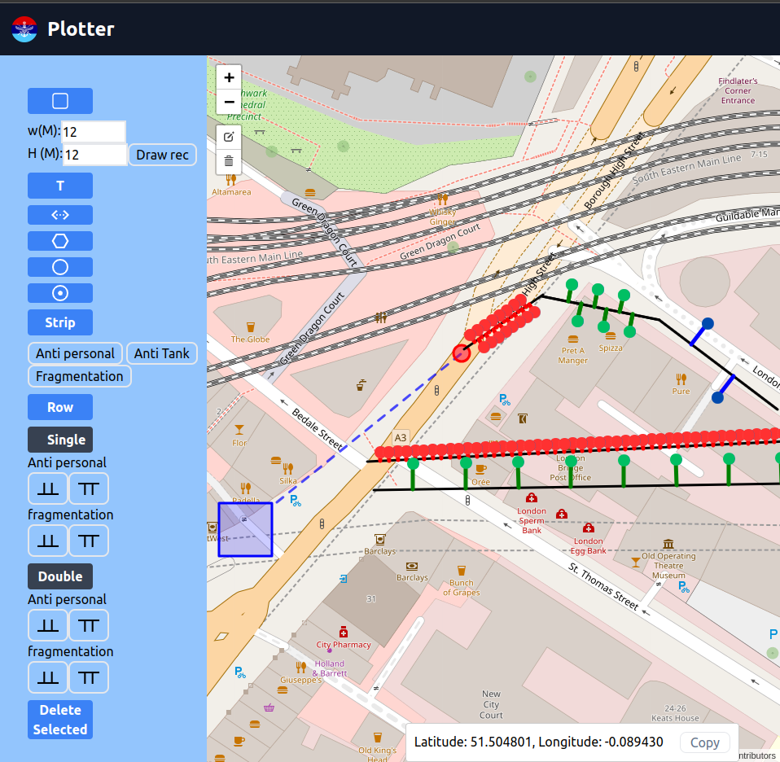

# MineMapper

## Overview

**MineMapper** is a web application designed for military use to assist in planning and visualizing minefield layouts. Built with HTML, CSS, Tailwind CSS, and Leaflet, this tool provides an interactive map-based interface for precise mine placement and customization.



## Features

- **Interactive Interface**: Draw and customize mine layouts directly on the map.
- **Real-Time Updates**: Utilize dynamic maps with Leaflet for real-time geographical context.
- **Customization Options**: Specify mine types, quantities, and exact locations.
- **User-Friendly Design**: Responsive elements using Tailwind CSS for accessibility on various devices.

## Technologies Used

- **HTML**
- **CSS**
- **Tailwind CSS**
- **Leaflet**

## Installation

1. Clone the repository:
    ```sh
    git clone https://github.com/Sarvottam999/MinePlotter.git
    ```
2. Navigate to the project directory:
    ```sh
    cd MinePlotter
    ```


## Usage

1. Open `index.html` in your web browser.
2. Use the drawing tools to outline your minefield.
3. Customize mine placements by selecting types and quantities.
4. Save or export your layout as needed.


